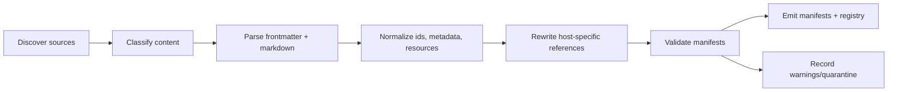

# ClaudeKit Importer and Manifest Spec (Phase 4)

**Project**: CodexKit  
**Scope**: Phase 4 content import  
**Last Updated**: 2026-03-12  
**Status**: Draft for implementation

## 1) Purpose

Define the Phase 4 importer that converts ClaudeKit workspace content into CodexKit manifests without mutating the source workspace.

This phase exists to preserve reusable ClaudeKit behavior:

- role specialization from `.claude/agents/*.md`
- workflow intent from `.claude/skills/*/SKILL.md`
- policy guidance from `.claude/rules/*.md`
- plan skeletons from `plans/templates/*`

This phase does not recreate Claude-native runtime internals. It extracts content, normalizes host-specific assumptions, and emits deterministic manifest files under `.codexkit/manifests/`.

## 2) Scope

In scope:

- importer discovery, parse, normalize, validate, emit pipeline
- role manifests
- workflow manifests
- policy pack manifests
- template manifests
- source-to-target mapping rules
- unsupported and legacy content handling
- migration safety and auditability

Out of scope:

- runtime DB internals
- worker launcher implementation
- daemon event loop behavior
- plan hydration and sync-back internals
- hook execution runtime
- browser or statusline runtime UX

## 3) Current Source Baseline

The current repo snapshot contains:

- `14` agent files in `.claude/agents/`
- `68` skill entrypoints in `.claude/skills/*/SKILL.md`
- `5` rules in `.claude/rules/`
- `4` files in `plans/templates/`
- `19` archived command files under `.claude/command-archive/`

Phase 4 must treat this as a mixed source tree:

- active content to import
- helper content to reference
- host-specific content to audit and skip
- legacy content to mark as non-blocking

## 4) Import Surface

| Source | Target | Phase 4 action |
|---|---|---|
| `.claude/agents/*.md` | `.codexkit/manifests/roles/*.role.json` | Import |
| `.claude/skills/*/SKILL.md` | `.codexkit/manifests/workflows/*.workflow.json` | Import |
| `.claude/rules/*.md` | `.codexkit/manifests/policies/*.policy.json` | Import |
| `plans/templates/*-template.md` | `.codexkit/manifests/templates/*.template.json` | Import |
| `plans/templates/template-usage-guide.md` | linked resource from template manifests | Reference only |
| `.claude/.ck.json` | provenance/settings hints in registry | Read-only metadata |
| `.claude/metadata.json` | provenance/settings hints in registry | Read-only metadata |
| `.claude/settings.json` | audit only | Skip |
| `.claude/hooks/**` | audit only | Skip |
| `.claude/command-archive/**` | legacy audit only | Skip by default |
| `.claude/scripts/**` | resource only when directly referenced by imported skill | Best effort |
| `.claude/output-styles/**` | audit only | Skip |
| `.claude/schemas/**` | audit only | Skip |

## 5) Output Layout

```text
.codexkit/
├── manifests/
│   ├── roles/
│   │   └── {role-id}.role.json
│   ├── workflows/
│   │   └── {workflow-id}.workflow.json
│   ├── policies/
│   │   └── {policy-id}.policy.json
│   ├── templates/
│   │   └── {template-id}.template.json
│   └── import-registry.json
```

Phase 4 writes only inside `.codexkit/`.

The importer must not:

- edit `.claude/**`
- rename existing source files
- delete legacy content
- rewrite `plans/templates/**`

## 6) Pipeline



### 6.1 Discover

Importer scans only whitelisted roots:

- `.claude/agents`
- `.claude/skills`
- `.claude/rules`
- `plans/templates`

It also reads `.claude/.ck.json` and `.claude/metadata.json` for provenance only.

### 6.2 Classify

Each discovered file is classified as one of:

- `role-source`
- `workflow-source`
- `policy-source`
- `template-source`
- `resource-source`
- `legacy-source`
- `unsupported-source`

Classification is path-driven first, content-driven second.

### 6.3 Parse

Parsing rules:

- normalize line endings to `\n`
- treat only the first leading `--- ... ---` block as frontmatter
- preserve all later `---` blocks as markdown body
- preserve UTF-8 text exactly
- do not require every source type to have frontmatter

This matters because the current repo contains files with:

- embedded YAML examples inside body
- multiple markdown separators after frontmatter
- `ck:` names that do not match strict public skill-spec directory rules
- CRLF in some skill files

### 6.4 Normalize

Normalization produces:

- canonical manifest id
- canonical output path
- source alias list
- raw body snapshot
- extracted structured fields
- resource index
- compatibility rewrite map
- warnings

### 6.5 Rewrite

Rewrite host-specific ClaudeKit references into CodexKit compatibility primitives without altering raw source snapshots.

Required rewrite targets:

| ClaudeKit reference | Normalized target |
|---|---|
| `AskUserQuestion` | `approval.request` |
| `TaskCreate` | `task.create` |
| `TaskList` | `task.list` |
| `TaskGet` | `task.get` |
| `TaskUpdate` | `task.update` |
| `Task(subagent_type=...)` or `Task(...)` | `worker.spawn` |
| `TeamCreate` | `team.create` |
| `TeamDelete` | `team.delete` |
| `SendMessage` | `message.send` |
| hook-injected plan/report context | context compiler inputs |

Unknown host tools are preserved in `raw` and flagged in `warnings`.

### 6.6 Validate

Validation must check:

- output id uniqueness
- source path existence
- manifest schema shape
- frontmatter parse success for roles and skills
- required core workflow rewrites present
- referenced resource paths exist
- no target path escapes `.codexkit/manifests/`

### 6.7 Emit

Emit order:

1. build all manifests in memory
2. validate full batch
3. write files to temp targets
4. atomically rename into final targets
5. write `import-registry.json` last

If validation fails for a core artifact, no partial final files may remain for that batch.

## 7) Common Manifest Envelope

All manifest types share the same top-level shape:

```json
{
  "schemaVersion": 1,
  "manifestType": "role",
  "id": "planner",
  "slug": "planner",
  "aliases": ["planner"],
  "status": "active",
  "source": {
    "path": ".claude/agents/planner.md",
    "kind": "agent-markdown",
    "checksum": "sha256:...",
    "importedAt": "2026-03-12T00:00:00Z"
  },
  "raw": {},
  "normalized": {},
  "resources": [],
  "warnings": []
}
```

Field rules:

| Field | Rule |
|---|---|
| `schemaVersion` | starts at `1` for Phase 4 |
| `manifestType` | one of `role`, `workflow`, `policy`, `template` |
| `id` | canonical CodexKit id |
| `slug` | filesystem-safe id, kebab-case |
| `aliases` | source ids and legacy names |
| `status` | `active`, `helper`, `deferred`, `legacy`, or `manual-review` |
| `source` | provenance only, never omitted |
| `raw` | exact parsed source snapshot |
| `normalized` | compatibility-ready extracted form |
| `resources` | referenced companion files, not always inlined |
| `warnings` | non-fatal import issues |

## 8) Role Manifest Format

Roles are imported from `.claude/agents/*.md`.

### 8.1 Required normalized fields

```json
{
  "schemaVersion": 1,
  "manifestType": "role",
  "id": "planner",
  "slug": "planner",
  "aliases": ["planner"],
  "status": "active",
  "source": {
    "path": ".claude/agents/planner.md",
    "kind": "agent-markdown",
    "checksum": "sha256:..."
  },
  "raw": {
    "frontmatter": {
      "name": "planner",
      "description": "...",
      "model": "opus",
      "memory": "project",
      "tools": ["Glob", "Grep", "Read", "TaskCreate"]
    },
    "bodyMarkdown": "You are an expert planner..."
  },
  "normalized": {
    "displayName": "planner",
    "summary": "...",
    "modelPreference": "opus",
    "memoryScope": "project",
    "toolCapabilities": {
      "local": ["glob", "grep", "read", "edit", "shell", "web"],
      "compat": ["task.create", "task.get", "task.update", "task.list", "message.send", "worker.spawn"],
      "unresolved": []
    },
    "promptMarkdown": "You are an expert planner...",
    "constraints": {
      "advisoryOnly": false,
      "defaultAccess": "plans-write",
      "ownedPathRequired": false
    },
    "teamMode": "parsed markdown section or null"
  },
  "resources": [],
  "warnings": []
}
```

### 8.2 Role mapping rules

- `id` comes from frontmatter `name`; fallback to file basename
- `slug` is filesystem-safe kebab-case derived from `id`
- `description`, `model`, `memory`, `tools` stay in `raw.frontmatter`
- full instruction body stays in `raw.bodyMarkdown`
- normalized tool capabilities are derived from frontmatter tools and body references
- unknown tools never block import unless the role is in the core parity set

### 8.3 Core role policy overrides

Phase 4 uses explicit overrides for core roles instead of fragile text heuristics:

| Role | `defaultAccess` | Notes |
|---|---|---|
| `brainstormer` | `read-only` | advisory only |
| `researcher` | `read-only` | report-first |
| `planner` | `plans-write` | may write plans, not product code |
| `code-reviewer` | `read-only` | findings only |
| `docs-manager` | `docs-write` | docs scope only |
| `project-manager` | `plans-write` | sync and status artifacts |
| `git-manager` | `git-ops` | commit/push remains approval-gated |
| `tester` | `owned-scope` | test updates only when assigned |
| `fullstack-developer` | `owned-scope` | implementation role |
| `ui-ux-designer` | `owned-scope` | frontend/design scope |

If a role is not in this table, importer uses `defaultAccess: "owned-scope"` unless the body contains a hard read-only phrase such as `Do NOT make code changes`.

### 8.4 Role status overrides

Not every imported agent becomes an active parity role immediately:

| Role | Import status | Reason |
|---|---|---|
| `code-simplifier` | `deferred` | compatibility matrix marks it post-V1 |
| `mcp-manager` | `manual-review` | requires CodexKit MCP-specific adaptation later |

All other imported agents default to `active` unless validation downgrades them.

## 9) Workflow Manifest Format

Workflows are imported from `.claude/skills/*/SKILL.md`.

Phase 4 must support both:

- core orchestrated workflows
- helper/reference skills that are not top-level CLI flows

### 9.1 Workflow classes

| Class | Meaning |
|---|---|
| `core` | direct `cdx:*` workflow target |
| `helper` | reusable helper skill, not a first-class CLI command in V1 |
| `reference` | knowledge pack or script pack with manual activation |

### 9.2 Required normalized fields

```json
{
  "schemaVersion": 1,
  "manifestType": "workflow",
  "id": "plan",
  "slug": "plan",
  "aliases": ["ck:plan"],
  "status": "active",
  "source": {
    "path": ".claude/skills/plan/SKILL.md",
    "kind": "skill-markdown",
    "checksum": "sha256:..."
  },
  "raw": {
    "frontmatter": {
      "name": "ck:plan",
      "description": "...",
      "argument-hint": "[task] OR archive|red-team|validate",
      "license": "MIT"
    },
    "bodyMarkdown": "# Planning\n..."
  },
  "normalized": {
    "workflowClass": "core",
    "command": "cdx plan",
    "displayName": "Plan",
    "argumentHint": "[task] OR archive|red-team|validate",
    "summary": "...",
    "promptMarkdown": "# Planning\n...",
    "modes": ["auto", "fast", "hard", "parallel", "two"],
    "subcommands": ["archive", "red-team", "validate"],
    "approvalGates": [],
    "requiredRoles": ["planner", "researcher"],
    "requiredPolicies": ["development-rules", "primary-workflow"],
    "compatRewrites": ["approval.request", "worker.spawn", "task.*"],
    "executionHints": {
      "supportsPlanHydration": true,
      "requiresUserReview": false
    }
  },
  "resources": [
    {
      "path": ".claude/skills/plan/references/workflow-modes.md",
      "kind": "markdown-reference",
      "mode": "reference"
    }
  ],
  "warnings": []
}
```

### 9.3 Core workflow override table

Phase 4 must apply explicit id and command overrides for parity-critical skills:

| Source skill | Source name | Target workflow id | Target command |
|---|---|---|---|
| `brainstorm` | `ck:brainstorm` | `brainstorm` | `cdx brainstorm` |
| `plan` | `ck:plan` | `plan` | `cdx plan` |
| `cook` | `ck:cook` | `cook` | `cdx cook` |
| `fix` | `ck:fix` | `fix` | `cdx fix` |
| `debug` | `ck:debug` | `debug` | `cdx debug` |
| `code-review` | `ck:code-review` | `review` | `cdx review` |
| `test` | `ck:test` | `test` | `cdx test` |
| `team` | `ck:team` | `team` | `cdx team` |
| `docs` | `ck:docs` | `docs` | `cdx docs` |
| `journal` | `ck:journal` | `journal` | `cdx journal` |
| `preview` | `ck:preview` | `preview` | `cdx preview` |
| `scout` | `ck:scout` | `scout` | `cdx scout` |

All other skills import as `helper` or `reference` workflows with `command: null`.

### 9.4 Workflow mapping rules

- use frontmatter `name` as source alias, not as final file name
- do not enforce public skill-spec rule that `name` equals directory name
- extract `argument-hint`, `version`, `license`, `allowed-tools`, `metadata` when present
- detect `modes` from mode tables and flag lists
- detect `subcommands` from explicit subcommand tables
- detect `requiredRoles` from phrases like `spawn planner`, `required subagents`, or explicit role tables
- detect `approvalGates` from checkpoint sections
- keep full body markdown for later prompt compilation

### 9.5 Companion resources

Skill companion files are indexed, not blindly inlined:

| Companion path | Import rule |
|---|---|
| `references/**` | add as markdown resources |
| `workflows/**` | add as markdown resources |
| `scripts/**` | add as script resources, `mode: reference` |
| `assets/**` | add as opaque resources, `mode: metadata-only` |
| `README.md`, `LICENSE*` | add as docs resources |
| large binary/data files | index only, never inline |

If a helper skill depends on binaries or large asset bundles, set workflow `status: "manual-review"` instead of failing the whole import.

## 10) Policy Pack Format

Policies are imported from `.claude/rules/*.md`.

### 10.1 Required normalized fields

```json
{
  "schemaVersion": 1,
  "manifestType": "policy",
  "id": "development-rules",
  "slug": "development-rules",
  "aliases": ["development-rules"],
  "status": "active",
  "source": {
    "path": ".claude/rules/development-rules.md",
    "kind": "rule-markdown",
    "checksum": "sha256:..."
  },
  "raw": {
    "bodyMarkdown": "# Development Rules\n..."
  },
  "normalized": {
    "displayName": "Development Rules",
    "appliesTo": ["all"],
    "promptMarkdown": "# Development Rules\n...",
    "directives": [
      {"level": "must", "text": "Follow YAGNI, KISS, DRY"}
    ],
    "tags": ["global", "development"]
  },
  "resources": [],
  "warnings": []
}
```

### 10.2 Policy applicability table

| Rule file | Applies to |
|---|---|
| `development-rules.md` | all roles and workflows |
| `primary-workflow.md` | implementation-oriented workflows |
| `orchestration-protocol.md` | workflows that spawn roles or coordinate artifacts |
| `documentation-management.md` | docs-related finalize or update flows |
| `team-coordination-rules.md` | `team` workflow and team-mode roles only |

### 10.3 Policy extraction rules

- preserve full markdown body
- extract imperative bullets into `directives`
- tag rules by filename and section heading
- do not attempt full policy execution semantics in Phase 4
- keep host-hook-only behavior as prose, not executable policy code

## 11) Template Manifest Format

Templates are imported from `plans/templates/*-template.md`.

`template-usage-guide.md` is not a template manifest. It is a shared guide resource linked from template manifests.

### 11.1 Required normalized fields

```json
{
  "schemaVersion": 1,
  "manifestType": "template",
  "id": "feature-implementation",
  "slug": "feature-implementation",
  "aliases": ["feature-implementation-template"],
  "status": "active",
  "source": {
    "path": "plans/templates/feature-implementation-template.md",
    "kind": "plan-template-markdown",
    "checksum": "sha256:..."
  },
  "raw": {
    "bodyMarkdown": "# [Feature Name] Implementation Plan\n..."
  },
  "normalized": {
    "templateType": "feature-implementation",
    "displayName": "Feature Implementation",
    "bodyMarkdown": "# [Feature Name] Implementation Plan\n...",
    "placeholders": [
      "Feature Name",
      "YYYY-MM-DD",
      "path/to/file.ts"
    ],
    "sections": [
      "Executive Summary",
      "Requirements",
      "Architecture Overview",
      "Implementation Phases",
      "Testing Strategy"
    ],
    "recommendedWhen": "new functionality, endpoints, services, modules"
  },
  "resources": [
    {
      "path": "plans/templates/template-usage-guide.md",
      "kind": "markdown-guide",
      "mode": "reference"
    }
  ],
  "warnings": []
}
```

### 11.2 Template mapping rules

- template id comes from filename without `-template.md`
- body remains literal markdown
- placeholders are extracted from bracket tokens, uppercase date tokens, and obvious file placeholders
- `recommendedWhen` comes from `template-usage-guide.md` when a matching section exists
- non-template files under `plans/templates/` never generate standalone template manifests

## 12) Source-to-Target Mapping Rules

### 12.1 Id canonicalization

- strip file extensions
- convert filesystem ids to kebab-case
- replace `:` with `-` for `slug`
- keep original `ck:*` value in `aliases`
- use explicit override table for parity-critical workflows

Examples:

| Source | Canonical id | Slug | Output file |
|---|---|---|---|
| `.claude/agents/planner.md` | `planner` | `planner` | `roles/planner.role.json` |
| `.claude/skills/plan/SKILL.md` | `plan` | `plan` | `workflows/plan.workflow.json` |
| `.claude/skills/code-review/SKILL.md` | `review` | `review` | `workflows/review.workflow.json` |
| `.claude/rules/team-coordination-rules.md` | `team-coordination-rules` | `team-coordination-rules` | `policies/team-coordination-rules.policy.json` |

### 12.2 Raw vs normalized preservation

Every manifest must preserve both:

- `raw`: original source data after parse
- `normalized`: compatibility-ready view

Importer must never destroy the source meaning by only keeping rewritten text.

### 12.3 Duplicate resolution

Duplicate ids are handled in this order:

1. explicit override table
2. exact source path priority from active directories
3. lexicographic path tie-break
4. losing source recorded as warning and registry conflict

`.claude/command-archive/**` can never win over active `.claude/skills/**`.

## 13) Unsupported and Legacy Handling

| Source kind | Phase 4 handling | Why |
|---|---|---|
| `.claude/settings.json` | audit only | host runtime contract, not manifest content |
| `.claude/hooks/**` | skip, add rewrite hint only | behavior moves to daemon/context compiler |
| `.claude/statusline.*` | skip | terminal UI concern, not manifest content |
| `.claude/command-archive/**` | skip by default, record as `legacySkipped` | archived and lower migration value |
| `.claude/scripts/**` not referenced by active skill | skip | tooling, not workflow definition |
| `.claude/output-styles/**` | skip | no target manifest type in Phase 4 |
| `.claude/schemas/**` | skip | support artifacts only |
| malformed agent or skill frontmatter | quarantine entry, no manifest | unsafe to guess |
| unknown host tool names | keep in `raw`, warn in `normalized.toolCapabilities.unresolved` | future adapter may exist |
| helper skill with unsupported binary assets | import as `manual-review` | non-blocking for core parity |

Legacy opt-in behavior:

- optional future flag: `--include-legacy`
- if enabled, archived commands become `workflow` manifests with `status: "legacy"`
- legacy manifests never map to `cdx:*` commands automatically

## 14) Migration Safety Rules

Phase 4 is migration-safe only if all of the following are true:

1. importer is non-destructive
   - source files are never edited
   - existing manifests are never overwritten silently

2. writes are bounded
   - output stays under `.codexkit/`
   - target paths are canonicalized before write

3. provenance is durable
   - every manifest stores source path and checksum
   - registry stores import time and warnings

4. partial failure is contained
   - one malformed helper skill does not corrupt core manifests
   - one failed batch does not leave partial final files

5. conflicts are explicit
   - duplicate ids fail validation for core artifacts
   - helper conflicts are warnings unless promoted to core

6. rewrite coverage is auditable
   - all known Claude-native primitives must appear in `compatRewrites` when present in source
   - unresolved runtime assumptions must be listed in warnings

7. reruns are deterministic
   - same source tree and same overrides produce byte-stable manifest output

## 15) Import Registry

`import-registry.json` is the batch audit record for Phase 4.

Required contents:

- source metadata from `.claude/.ck.json` and `.claude/metadata.json` when available
- imported manifest list
- skipped legacy list
- skipped unsupported list
- conflict list
- warning list
- per-source checksum

Minimal shape:

```json
{
  "schemaVersion": 1,
  "importedAt": "2026-03-12T00:00:00Z",
  "sourceRoot": ".",
  "sourceKit": {
    "ckConfigFound": true,
    "metadataFound": true
  },
  "summary": {
    "roles": 14,
    "coreWorkflows": 12,
    "helperWorkflows": 52,
    "policies": 5,
    "templates": 3,
    "legacySkipped": 19
  },
  "entries": [],
  "warnings": []
}
```

## 16) Phase 4 Acceptance Criteria

Phase 4 is complete only if:

- all core roles import into valid role manifests
- all core workflows in the override table import into valid workflow manifests
- all 5 rule files import into policy manifests
- `feature-implementation`, `bug-fix`, and `refactor` import into template manifests
- `template-usage-guide.md` is linked as a resource, not misclassified as a template
- archived commands are skipped and audited, not auto-promoted
- settings/hooks/statusline content is skipped and audited, not misrepresented as executable manifests
- known Claude-native references are rewritten into compatibility primitives
- registry output is deterministic and complete

## Unresolved Questions

- Whether helper skills with script dependencies should stay `reference` only in V1 or gain adapter-backed execution later
- Whether `.claude/output-styles/**` should become a separate manifest family after core parity is stable
- Whether future imports should vendor referenced markdown resources into `.codexkit/` or continue referencing source paths plus checksums
