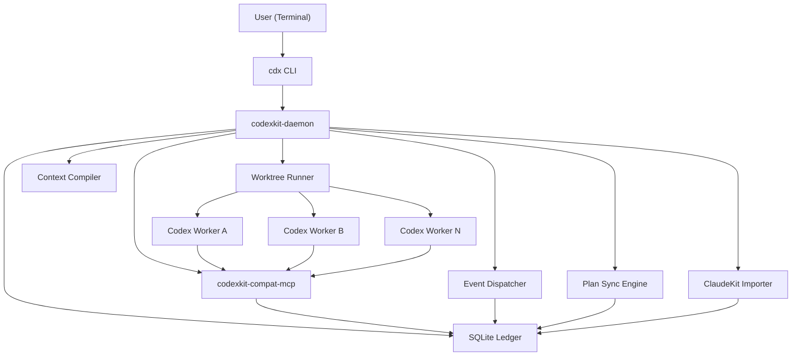

# System Architecture

**Project**: CodexKit
**Version**: 0.1.0-draft
**Last Updated**: 2026-03-20
**Primary Runtime Target**: Local Codex CLI
**Primary UX**: Terminal-first

## Overview

CodexKit implements a local-first orchestration runtime that recreates ClaudeKit workflow semantics on top of Codex. The architecture replaces Claude-native primitives with a deterministic control plane that manages tasks, workers, messages, approvals, plans, and artifacts.

The architectural target is functional parity, not host-runtime parity. The system preserves what users experience:
- the same workflows
- the same role separation
- the same plan-first execution model
- the same gates
- the same durable reports and plan sync behavior

## Architectural Pattern

**Primary Pattern**: Control plane plus isolated worker runtime

**Secondary Patterns**:
- Event-driven orchestration
- Task graph scheduling
- Artifact-first collaboration
- Worktree-based sandbox isolation
- Compatibility facade over host-specific content

## Design Principles

- Runtime primitives must be explicit and durable
- Worker coordination must be state-driven, not transcript-driven
- Context must be compiled, not inherited blindly
- Worker isolation must be stronger than in ClaudeKit
- Compatibility should be generated from ClaudeKit content where possible
- User control points must remain visible and interactive in terminal

## Host Features CodexKit Uses

CodexKit should use current Codex host features where they help, but not treat them as the parity runtime:

- root `AGENTS.md` instruction layering remains the canonical project guidance surface
- `.codex/config.toml` is the project-scoped host config surface for approvals, sandbox, features, and MCP registration
- Codex native MCP support is transport only; CodexKit still owns compatibility semantics and durable state
- Codex native multi-agent roles may help later, but CodexKit does not rely on an experimental host feature for parity-critical task, mailbox, or approval behavior

## CLI Surface Policy

- Public terminal syntax uses `cdx <workflow>` and `cdx <operator> <subcommand>`
- Primary workflow commands are `cdx brainstorm`, `cdx plan`, `cdx cook`, `cdx fix`, `cdx debug`, `cdx review`, `cdx test`, `cdx team`, `cdx docs`, `cdx journal`, `cdx scout`, and `cdx preview`
- Operator commands are `cdx init`, `cdx doctor`, `cdx resume`, `cdx update`, plus lower-level inspection commands such as `cdx daemon ...`, `cdx run ...`, and `cdx task ...`
- Continuation remains first-class through both `cdx resume` and explicit plan-path re-entry such as `cdx cook /abs/path/to/plan.md`
- Public shell syntax is always the space-separated `cdx ...` form; only verbatim ClaudeKit source references may retain legacy labels

## Phase 10 Public Package Contract (Frozen Shared Slice)

- Public npm package contract: `@codexkit/cli`
- Public binary contract: `cdx`
- Public install command forms:
  - `npx @codexkit/cli init`
  - `npx @codexkit/cli doctor`
  - `npm install -g @codexkit/cli`
  - `cdx init`
  - `cdx doctor`
- Runner resolution order contract:
  1. env override `CODEXKIT_RUNNER`
  2. `.codexkit/config.toml` with `[runner] command = "..."`
  3. default `codex exec`
- `cdx doctor` surfaces the active runner source plus effective runner command and blocks with typed diagnostics when the selected runner is unavailable
- `cdx init` preview/apply surfaces the active runner source plus effective runner command
- Account/session binding stays external: CodexKit binds to the selected runner and does not own Codex account login state

## Run, Worker, and Session Relationship

- One top-level workflow invocation maps to one durable run in the CodexKit ledger
- One run may create zero or more tasks and zero or more worker attempts over time
- One worker attempt maps to one fresh Codex process/session in one dedicated worktree
- A worker retry or resume creates a new worker attempt and a new Codex process, even when it belongs to the same run and same task
- Cross-workflow handoff such as brainstorm -> plan creates a new downstream run linked to the upstream run by artifact refs and handoff metadata
- Auto-approval policy is run-scoped. Downstream runs inherit it only when the workflow engine emits explicit handoff policy derived from ClaudeKit source behavior
- The terminal may stay attached across a handoff, but workflow continuity is controlled by ledger state rather than transcript continuity
- Plan files remain the persistent portability layer across shells and fresh sessions; live task state is an optimization, not the sole continuity mechanism

## Top-Level Architecture



## NFR Traceability

`docs/non-functional-requirements.md` is the canonical quality contract for this architecture.

| Architecture area | Primary components | Primary NFRs |
|---|---|---|
| Continuity plane | `cdx` CLI, `codexkit-daemon`, SQLite ledger, context compiler, plan sync engine | `NFR-1` |
| Isolation plane | worktree runner, worktree manager, ownership policy, artifact staging | `NFR-2` |
| Interaction plane | command parser, approval renderer, workflow handoff output, diagnostic surface | `NFR-3` |
| Migration safety plane | `cdx init`, `cdx doctor`, `cdx update`, importer, manifest registry | `NFR-4` |
| Observability plane | ledger events, logs, artifact store, run and task inspection views | `NFR-5` |
| Context fidelity plane | context compiler, handoff bundle schema, decision reports, plan artifacts, resume summaries | `NFR-6` |
| Throughput plane | scheduler, worker launcher, worktree manager, team runtime, claim engine | `NFR-7` |
| Host compatibility plane | capability detector, version matrix, `cdx doctor`, fallback policy, Codex config adapter | `NFR-8` |

## System Components

### 1. `cdx` CLI

**Responsibility**
- Parse user commands
- Start or attach to daemon
- Submit workflow requests
- Render approvals, inbox, and run status in terminal

**Commands**
- `cdx init`
- `cdx doctor`
- `cdx resume`
- `cdx brainstorm`
- `cdx plan`
- `cdx cook`
- `cdx fix`
- `cdx debug`
- `cdx review`
- `cdx test`
- `cdx team`
- `cdx docs`
- `cdx journal`
- `cdx scout`
- `cdx preview`

**Key behaviors**
- Translate user requests into workflow start requests
- Render approval prompts
- Support direct targeting like `@planner`, `@team/dev-2`

### 2. `codexkit-daemon`

**Responsibility**
- Central control plane
- Task scheduling
- Worker lifecycle management
- Team state
- Approval coordination
- Event processing

**Why it exists**
- Codex does not provide a Claude-native shared task graph or team message bus
- The daemon becomes the single source of orchestration state

### 3. SQLite Ledger

**Responsibility**
- Durable state store for all orchestration entities

**Storage choice**
- SQLite with WAL mode for v1
- Simple local deployment
- Durable enough for terminal-first single-machine operation

### 4. Event Dispatcher

**Responsibility**
- Consume new state transitions
- Wake workers or terminal prompts
- Trigger retries, reclaims, finalize actions, and sync-back

**Model**
- Internal event table plus dispatcher loop
- Later upgradable to Redis Streams or NATS if needed

### 5. Worktree Runner

**Responsibility**
- Create and clean worker worktrees
- Launch isolated Codex sessions
- Bind worker metadata, role prompt, and context pack

**Isolation model**
- One worker, one worktree
- Explicit owned paths
- Optional read-only role policy

### 6. Context Compiler

**Responsibility**
- Build minimal, role-specific context packets for workers

**Inputs**
- Role manifest
- Task description
- Plan metadata
- Ownership constraints
- Relevant artifacts
- Relevant docs and rules
- Mailbox summary

**Outputs**
- Compiled worker prompt
- Context attachments
- Referenced artifacts

### 7. Compatibility MCP

**Responsibility**
- Expose runtime primitives to Codex workers through tool calls
- Preserve ClaudeKit-like operational semantics

**Tools**
- `task.create`
- `task.list`
- `task.get`
- `task.update`
- `team.create`
- `team.delete`
- `worker.spawn`
- `message.send`
- `message.pull`
- `approval.request`
- `approval.respond`
- `artifact.publish`
- `artifact.read`
- `workflow.start`

### 8. Plan Sync Engine

**Responsibility**
- Hydrate task graph from markdown plans
- Sync completed state back to `plan.md` and `phase-*.md`

**Parity target**
- Match the workflow described in ClaudeKit native task docs and `cook` finalize steps

### 9. ClaudeKit Importer

**Responsibility**
- Import existing content from `.claude/`
- Separate content from host-specific runtime assumptions

**Input sources**
- `.claude/agents/*.md`
- `.claude/skills/**`
- `.claude/rules/*.md`

Wave 1 excludes template sources because `plans/templates/` is absent in the current repo baseline. Template import can be added only after source restoration and a new Phase 4 freeze.

## Proposed Repository Layout

```text
.
├── AGENTS.md
├── .codex/
│   └── config.toml and optional Codex project config
├── .codexkit/
│   ├── config.toml
│   ├── state/
│   │   ├── codexkit.db
│   │   └── logs/
│   ├── manifests/
│   │   ├── roles/
│   │   ├── workflows/
│   │   ├── policies/
│   │   └── templates/
│   ├── cache/
│   └── runtime/
├── docs/
├── plans/
├── cdx
└── packages/
    ├── codexkit-cli/
    ├── codexkit-core/
    ├── codexkit-db/
    ├── codexkit-daemon/
    ├── codexkit-compat-mcp/
    ├── codexkit-importer/
    ├── codexkit-runner/
    ├── codexkit-context/
    └── codexkit-plan-sync/
```

## Core Data Model

Representative tables are summarized below. Exact field names, optional columns, and indexes are authoritative in `docs/codexkit-sqlite-schema.sql`.

### Table: `runs`

| Column | Type | Notes |
|---|---|---|
| `id` | text pk | Global run id |
| `workflow` | text | `cook`, `plan`, `brainstorm`, etc. |
| `status` | text | pending, running, blocked, completed, failed, cancelled |
| `root_task_id` | text | Entry task |
| `created_at` | datetime | |
| `updated_at` | datetime | |

### Table: `tasks`

| Column | Type | Notes |
|---|---|---|
| `id` | text pk | Task id |
| `run_id` | text | Parent run |
| `team_id` | text nullable | Team scope |
| `subject` | text | Human-readable task |
| `active_form` | text nullable | Runtime status label |
| `description` | text | Full brief |
| `role` | text | Target worker role |
| `status` | text | pending, ready, in_progress, blocked, completed, failed, cancelled |
| `priority` | integer | Scheduling priority |
| `owner_worker_id` | text nullable | Claimed by worker |
| `plan_dir` | text nullable | Related plan folder |
| `phase_file` | text nullable | Related phase file |
| `metadata_json` | text | JSON metadata |
| `created_at` | datetime | |
| `updated_at` | datetime | |

### Table: `task_dependencies`

| Column | Type | Notes |
|---|---|---|
| `task_id` | text | Blocked task |
| `depends_on_task_id` | text | Upstream dependency |

### Table: `claims`

| Column | Type | Notes |
|---|---|---|
| `id` | text pk | Claim id |
| `task_id` | text | Claimed task |
| `worker_id` | text | Worker |
| `lease_until` | datetime | Reclaim threshold |
| `status` | text | active, released, expired, superseded |
| `created_at` | datetime | |

### Table: `workers`

| Column | Type | Notes |
|---|---|---|
| `id` | text pk | Worker id |
| `role` | text | planner, tester, reviewer |
| `team_id` | text nullable | Team scope |
| `state` | text | starting, idle, running, blocked, waiting_message, waiting_approval, stopped, failed |
| `worktree_path` | text | Execution root |
| `owned_paths_json` | text | JSON array |
| `run_id` | text | Parent run |
| `last_heartbeat_at` | datetime | |

### Table: `teams`

| Column | Type | Notes |
|---|---|---|
| `id` | text pk | Team id |
| `run_id` | text | Parent run |
| `name` | text | Human-readable name |
| `orchestrator_worker_id` | text | Team lead |
| `status` | text | active, idle, waiting, shutting_down, deleted |

### Table: `messages`

| Column | Type | Notes |
|---|---|---|
| `id` | text pk | Message id |
| `run_id` | text | Parent run |
| `team_id` | text nullable | Team scope when applicable |
| `from_kind` | text | system, user, worker, team |
| `from_id` | text nullable | Sender identity |
| `from_worker_id` | text nullable | Sender worker when applicable |
| `to_kind` | text | worker, team, user |
| `to_id` | text | Recipient id |
| `message_type` | text | message, status, shutdown_request, shutdown_response, approval_request, approval_response, plan_approval_response |
| `priority` | integer | |
| `body` | text | Summarized body |
| `artifact_refs_json` | text | JSON refs |
| `delivered_at` | datetime nullable | First successful delivery |
| `read_at` | datetime nullable | |
| `created_at` | datetime | |

### Table: `mailbox_cursors`

| Column | Type | Notes |
|---|---|---|
| `owner_kind` | text | user, worker, team |
| `owner_id` | text | Mailbox owner id |
| `last_message_id` | text nullable | Cursor checkpoint |
| `last_message_at` | datetime nullable | Last observed delivery time |
| `updated_at` | datetime | |

### Table: `artifacts`

| Column | Type | Notes |
|---|---|---|
| `id` | text pk | Artifact id |
| `run_id` | text | Parent run |
| `task_id` | text nullable | Source task |
| `worker_id` | text nullable | Author |
| `kind` | text | report, patch, test-log, review, plan, summary |
| `path` | text | File path |
| `summary` | text | Short summary |
| `created_at` | datetime | |

### Table: `approvals`

| Column | Type | Notes |
|---|---|---|
| `id` | text pk | Approval id |
| `run_id` | text | Parent run |
| `task_id` | text nullable | Related task |
| `checkpoint` | text | post-research, post-plan, post-implementation, post-testing |
| `status` | text | pending, approved, revised, rejected, aborted, expired |
| `question` | text | Prompt shown in terminal |
| `response` | text nullable | User response |
| `created_at` | datetime | |
| `resolved_at` | datetime nullable | |

### Table: `events`

| Column | Type | Notes |
|---|---|---|
| `id` | integer pk | Sequence id |
| `run_id` | text | Parent run |
| `event_type` | text | `task.claimed`, `message.sent`, etc. |
| `entity_type` | text | task, worker, team, run |
| `entity_id` | text | Entity id |
| `payload_json` | text | Event payload |
| `created_at` | datetime | |

## Event Model

### Core Event Types

- `run.started`
- `task.created`
- `task.ready`
- `task.claimed`
- `task.blocked`
- `task.completed`
- `task.failed`
- `worker.spawned`
- `worker.idle`
- `worker.heartbeat_missed`
- `message.sent`
- `message.received`
- `approval.requested`
- `approval.resolved`
- `artifact.published`
- `plan.hydrated`
- `plan.synced`
- `team.created`
- `team.deleted`

### Dispatcher Rules

- When a dependency completes, re-evaluate blocked tasks
- When a message arrives for an idle worker, wake that worker
- When a worker lease expires, reclaim task and emit `task.ready`
- When finalize steps complete, emit `plan.synced` and mark run complete

## Worker Lifecycle

### Lifecycle States

`starting -> idle -> running -> waiting_message -> waiting_approval -> running -> stopped`

### Worker Start Sequence

1. Runner creates worktree
2. Context compiler builds task packet
3. Runner launches a fresh Codex worker process/session from the launch bundle, role manifest, and task context
4. Worker registers heartbeat
5. Worker enters `idle` or claims assigned task immediately

### Worker Stop Sequence

1. Worker publishes final artifacts
2. Worker updates task state
3. Worker sends summary message if required
4. Daemon releases claims
5. Worker becomes `stopped`

## Auto-Claim Protocol

### Selection Criteria

- Task is `ready`
- Worker role matches task role
- Worker belongs to the same run and team scope
- Ownership scope is compatible
- Worker has no active conflicting claim

### Claim Algorithm

1. Worker polls or receives `task.ready`
2. Daemon attempts atomic claim transaction
3. Create claim row with lease timeout
4. Mark task `in_progress`
5. Assign owner worker

### Reclaim Algorithm

1. Check missed heartbeat or expired lease
2. Mark claim `expired`
3. Reset task to `ready`
4. Emit `task.ready`
5. Add failure note to event log

## Messaging Model

### Message Types

- `message`
- `status`
- `shutdown_request`
- `shutdown_response`
- `approval_request`
- `approval_response`
- `plan_approval_response`

### Routing Rules

- `worker -> worker` direct mailbox delivery
- `worker -> team` delivered to team inbox and orchestrator
- `worker -> user` shown in terminal attention queue
- `user -> worker` routed by `@worker`
- `user -> team` routed by `@team`

### Context Protection

Workers do not receive full raw chat history by default.
They receive:
- the new message
- short conversation summary
- referenced artifacts
- current task state

## Approval Model

### Checkpoints

- Post-research
- Post-plan
- Post-implementation
- Post-testing
- Optional custom gates from workflow manifests

### Terminal Rendering

The CLI renders approval prompts with:
- current checkpoint
- concise summary
- available actions

### Actions

- approve
- revise
- reject
- abort
- auto-approve for run

## Plan Hydration and Sync-Back

### Hydration

1. Parse `plan.md`
2. Parse all `phase-*.md`
3. Extract unchecked items
4. Create tasks with metadata:
- phase
- step
- planDir
- phaseFile
- priority
- ownership hints

### Sync-Back

1. Collect completed tasks and artifacts
2. Match them to phase items
3. Backfill stale unchecked items
4. Update `plan.md` frontmatter and progress table
5. Produce unresolved mapping report if needed

## Compatibility Import Pipeline

### Imported from ClaudeKit

- Agents to role manifests
- Skills to workflow manifests
- Rules to policy packs
- Templates to plan templates

### Normalization Steps

1. Parse YAML frontmatter and body
2. Extract runtime assumptions
3. Replace Claude-native tool references with CodexKit compatibility tool names
4. Preserve output requirements, report patterns, and role behavior
5. Emit manifest files into `.codexkit/manifests/`

### Host-Specific Rewrite Targets

- `AskUserQuestion` -> `approval.request`
- `TaskCreate/List/Get/Update` -> `task.*`
- `Task(subagent_type=...)` -> `worker.spawn`
- `TeamCreate/Delete` -> `team.*`
- `SendMessage` -> `message.send`
- Hook-injected plan context -> context compiler inputs

## Workflow Engine

### `cdx brainstorm`

- Scout current repo
- Ask clarifying questions through approval/user prompt layer
- Spawn planner or researchers if needed
- Produce a decision report
- Offer handoff to planning

### `cdx plan`

- Research and synthesize
- Support `validate`, `red-team`, and `archive` subcommands
- Generate `plan.md` and `phase-*.md`
- Optionally hydrate the task graph immediately

### `cdx cook`

- Detect mode: interactive, auto, fast, parallel, no-test, code
- Run research and planning if needed
- Hydrate or pick up tasks
- Spawn implementation workers
- Force testing delegation
- Force code review delegation
- Force finalize delegation
- Sync plans and docs

### `cdx team`

- Create team scope
- Spawn team-specific workers
- Use team inbox and worker messaging
- Allow idle/wake via messages or task completion
- Shut down cleanly after synthesis

### `cdx docs`

- Run `init`, `update`, or `summarize` against repo documentation
- Preserve docs-manager style analysis and update behavior

### `cdx journal`

- Write concise journal entries for changes, sessions, or migration milestones
- Persist output under project docs

### `cdx scout`

- Run fast codebase scouting as a public workflow
- Feed concise findings into planning, review, fix, and debug flows

### `cdx preview`

- Preview files and directories
- Generate explainers, slides, diagrams, or ASCII output in terminal/file-first mode

## Proposed Public MCP Tool Contract

### `task.create`

Input:
- `subject`
- `description`
- `role`
- `metadata`
- `depends_on`
- `team_id`

Output:
- `task_id`
- `status`

### `task.list`

Input:
- optional filters: `status`, `role`, `team_id`, `run_id`

Output:
- compact task list with dependency and owner state

### `task.get`

Input:
- `task_id`

Output:
- full task description, metadata, dependencies, artifacts

### `task.update`

Input:
- `task_id`
- patch object for `status`, `owner`, `metadata`, `notes`

Output:
- updated record

### `worker.spawn`

Input:
- `role`
- `task_id`
- `team_id`
- `owned_paths`
- `mode`

Output:
- `worker_id`
- `state`

### `message.send`

Input:
- `to_kind`
- `to_id`
- `message_type`
- `body`
- `artifact_refs`

Output:
- `message_id`

### `message.pull`

Input:
- `worker_id` or `team_id`
- optional `since`

Output:
- unread or recent messages

### `approval.request`

Input:
- `checkpoint`
- `question`
- `task_id`
- `options`

Output:
- `approval_id`

### `artifact.publish`

Input:
- `kind`
- `path`
- `summary`
- `task_id`

Output:
- `artifact_id`

## Security Model

- Role-scoped permissions
- Owned-path enforcement
- Read-only roles where possible
- Explicit approval for destructive actions
- Audit log of high-risk operations
- Installer and updater flows that touch root `AGENTS.md` or `.codex/**` must route through explicit terminal approval because those are protected under Codex workspace-write

These controls are the architectural basis for `NFR-2` and the protected-write portions of `NFR-4`.

## Observability

### Terminal Views

- run summary
- task table
- worker state table
- pending approvals
- inbox
- recent artifacts

### Logs

- daemon logs
- per-worker launch logs
- event stream log
- sync-back reports

Observability exists to satisfy `NFR-5`, not just debugging convenience.

## Reliability Strategy

- WAL-backed persistence
- idempotent event processing
- lease-based reclaim
- graceful shutdown checkpoints
- resumable runs

These mechanisms are mandatory because `NFR-1` and `NFR-5` treat recovery and post-failure inspection as product contracts.

## Testing Strategy

### Unit Tests

- claim engine
- event reducer
- context compiler
- importer
- plan parser and sync-back

### Integration Tests

- `cdx plan` end-to-end
- `cdx cook` interactive and parallel modes
- worker crash and reclaim
- message wake-up behavior
- approval loop behavior
- fresh-session handoff sufficiency without transcript reuse
- parallel payoff benchmark against sequential baseline
- host compatibility and degraded-mode behavior on supported fixture repos

### Golden Parity Tests

Run the same scenario through ClaudeKit artifacts and CodexKit workflows, then compare:
- plan structure
- task graph
- report shape
- review/test/finalize presence
- sync-back correctness

Every suite above must report fixture ids and metric ids from `docs/non-functional-requirements.md` so phase close and release readiness are backed by executable evidence rather than narrative status.

## Open Source and Market Positioning

CodexKit is not intended to be a generic agent platform. It is a migration-grade compatibility runtime for ClaudeKit-style software delivery workflows on Codex. That makes it narrower than OpenHands and MetaGPT, and more complete than isolated skills or MCP experiments.

## Unresolved Questions

- Whether the first release should expose raw MCP tools to users or keep them internal
- Whether workers should share a single daemon session token or use per-worker auth material
- Whether v1 should include a lightweight dashboard in addition to terminal views
